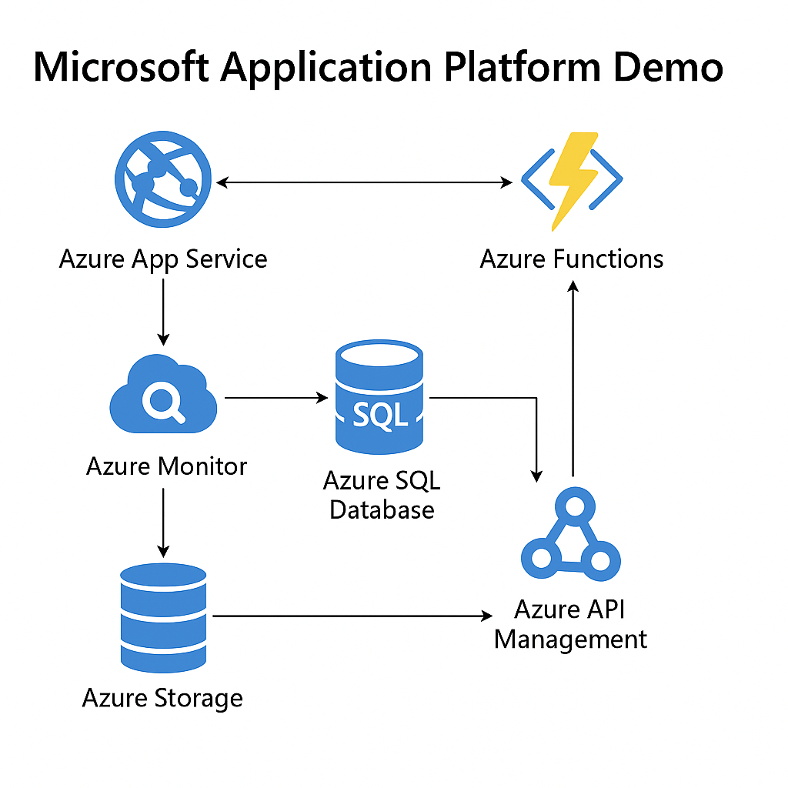

# Microsoft Application Platform Demo ☁️🚀

Este repositório demonstra uma arquitetura moderna baseada em serviços da plataforma Microsoft Azure. O projeto faz parte do desafio prático da DIO.

## 🧭 Visão Geral da Arquitetura

## 🛠️ Componentes Utilizados

- **Azure App Service**: Hospedagem da aplicação web.
- **Azure Functions**: Execução de lógicas sem servidor.
- **Azure SQL Database**: Banco relacional escalável.
- **Azure Monitor**: Observabilidade e métricas.
- **Azure Storage**: Armazenamento de blobs.
- **Azure API Management**: Controle e segurança de APIs.

## 🖼️ Prints Simulados

Simulação do painel de monitoramento e configuração do Azure.

## 📚 Aprendizados

Durante a construção deste projeto, aprofundei os conhecimentos sobre:
- Como orquestrar serviços gerenciados da Azure
- Benefícios da arquitetura serverless e monitoramento integrado
- Segurança e gestão centralizada com API Management

---

> Projeto desenvolvido como parte do desafio **Microsoft Application Platform** da DIO.
